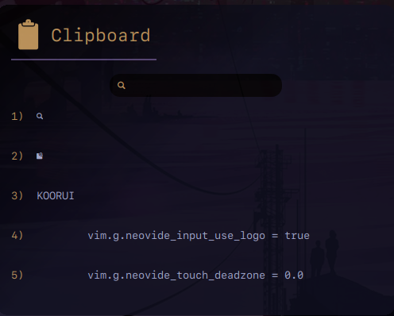

<h1 align="center"> AwesomeWm LuaClip</h1>
<p align="center"> Text Clipboard manager for Awesome Windows Manager </p>
<p align="center"> A quick way to retrieve previous clipboard entries inside awesome and quickly set them as the current selection, stores one hundred entries tryiing to keep it light weight and minimal.</p>


<h3>Update - 2024.04.17</h3>

- Cleaned up recent return to not return empty entries

- Added ability to remove entries for password copy


```lua
# Will find and replace in buffer/disk
awesome.connect_signal("clipboard::remove", function(string)
lclip:remove(string)
end)
```


```bash
# Will find and remove from buffer in buffer
awesome-client 'awesome.emit_signal("clipboard::remove", "match and remove")'

```

- any future suggestions welcome


<h3>Dependencies</h3>

- AwesomeWM
- Lua
- X11
- PkgConfig
- GLib
- Threads
- XFixes
- Cmake

<h3>Installation</h3>

```bash
git clone https://github.com/awesomeWM/LuaClip.git
cd LuaClip
cmake -S . -B build
cmake --build build
```
This will give you a libluaclip.so library that can be included in your configs, placed in your root directory of your awesomeWm config is the easiest.

<h3>Usage</h3>

```lua
local luaclip = require "libluaclip"
local lclip = luaclip()

lclip:daemon()
```
Will start the daemon in a seperate thread in the background, all communication is handled with GLIb and awesomeWM messaging system.

<h3>Functions</h3>

```lua
lclip:search("search term")
--return most recent 5 matching entries or NIL if none found

lclip:recent()
--return 5 most recent entries

lclip:select("selection")
--text to enter into clipboard can be pasted normally
```


<h3>Signal</h3>

```lua
awesome.connect_signal("clipboard::selection", function(selection)
for n, s in ipairs(selection) do
    selections[n] = s
end)
```

